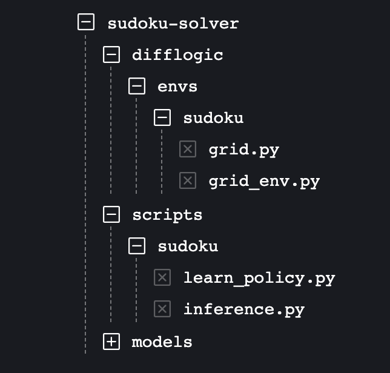

# Neuro-Symbolic Sudoku Solver
PyTorch implementation for the Neuro-Symbolic Sudoku Solver leveraging the power of Neural Logic Machines (NLM). **Please note that this is not an officially supported Google product.**  This project is a direct application of work done as part of original [NLM project](https://github.com/google/neural-logic-machines). We have applied NLM concept to solve more complex (Solving Sudoku) problems.

<div align="center">
  
</div>  

:star: Star us on GitHub — it helps!

Neural Logic Machine (NLM) is a neural-symbolic architecture for both inductive learning and logic reasoning. NLMs use tensors to represent logic predicates. This is done by grounding the predicate as
True or False over a fixed set of objects. Based on the tensor representation, rules are implemented
as neural operators that can be applied over the premise tensors and generate conclusion tensors. Learn more about NLM from the [paper](https://arxiv.org/pdf/1904.11694.pdf).

## Predicate Logic
We have used below boolean predicates as inputs to NLM architecture:  
1. `isRow(r, num)`: Does number `num` present in row `r` inside Sudoku grid?
2. `isColumn(c, num)`: Does number `num` present in column `c` inside Sudoku grid?
3. `isSubMat(r, c, num)`: Does number `num` present in 3x3 sub-matrix starting with row `r` and column `c`.  

Note here that `isRow` and `isColumn` are binary predicates and `isSubMat` is ternary predicate. We have stacked the results of `isRow` and `isColumn` and inputted as binary predicate.

The core architecture of the model contains deep reinforcement learning leveraging representation power of first order logic predicates.

## Prerequisites
* Python 3.x
* PyTorch 0.4.0
* [Jacinle](https://github.com/vacancy/Jacinle). We use the version [ed90c3a](https://github.com/vacancy/Jacinle/tree/ed90c3a70a133eb9c6c2f4ea2cc3d907de7ffd57) for this repo.
* Other required python packages specified by `requirements.txt`. See the Installation.

## Installation

Clone this repository:

```
git clone https://github.com/ashutosh1919/neuro-symbolic-sudoku-solver.git --recursive
```

Install [Jacinle](https://github.com/vacancy/Jacinle) included as a submodule. You need to add the bin path to your global `PATH` environment variable:

```
export PATH=<path_to_neural_logic_machines>/third_party/Jacinle/bin:$PATH
```

Create a conda environment for NLM, and install the requirements. This includes the required python packages
from both Jacinle and NLM. Most of the required packages have been included in the built-in `anaconda` package:

```
conda create -n nlm anaconda
conda install pytorch torchvision -c pytorch
```

## Usage

This repo is extension of original NLM repository. We haven't removed the codebase of problems solved in the base repository but we are only maintaining the Sudoku codebase in this repository.

Below is the file structure for the code we have added to original repository to understand things better.  

<div align="center">
  
</div>  

The code in `difflogic/envs/sudoku` contains information about the environment for reinforcement learning. `grid.py` selects dataset randomly from [1 Million Sudoku Dataset from Kaggle](https://www.kaggle.com/bryanpark/sudoku). `grid_env.py` creates reinforcement learning environment which can perform actions.

The code in `scripts/sudoku/learn_policy.py` trains the model whereas `scripts/sudoku/inference.py` generates prediction from trained model.

We also provide pre-trained models for 3 decision-making tasks in [models](models) directory,

Taking the [Blocks World](scripts/blocksworld) task as an example.

``` shell
# To train the model:
$ jac-run scripts/sudoku/learn_policy.py --task sudoku --dump-dir models

# To infer the model:
$ jac-run scripts/sudoku/inference.py --task sudoku --load-checkpoint models/checkpoints/checkpoint_10.pth
```

Please refer to the [graph](scripts/graph) directory for training/inference details of other tasks.

## Contributors ✨

Thanks goes to these wonderful people ([emoji key](https://allcontributors.org/docs/en/emoji-key)):

<!-- ALL-CONTRIBUTORS-LIST:START - Do not remove or modify this section -->
<!-- prettier-ignore-start -->
<!-- markdownlint-disable -->
<table>
  <tr>
    <td align="center"><a href="https://github.com/ashutosh1919"><br /><sub><b>Ashutosh Hathidara</b></sub></a><br /><a href="https://github.com/ashutosh1919/neuro-symbolic-sudoku-solver/commits?author=ashutosh1919" title="Code">💻</a> <a href="#ideas-ashutosh1919" title="Ideas, Planning, & Feedback">🤔</a> <a href="#maintenance-ashutosh1919" title="Maintenance">🚧</a> <a href="#design-ashutosh1919" title="Design">🎨</a> <a href="https://github.com/ashutosh1919/neuro-symbolic-sudoku-solver/commits?author=ashutosh1919" title="Documentation">📖</a> <a href="#question-ashutosh1919" title="Answering Questions">💬</a> <a href="#research-ashutosh1919" title="Research">🔬</a></td>
    <td align="center"><a href="https://github.com/pandeylalit9"><br /><sub><b>pandeylalit9</b></sub></a><br /><a href="https://github.com/ashutosh1919/neuro-symbolic-sudoku-solver/commits?author=pandeylalit9" title="Code">💻</a> <a href="#ideas-pandeylalit9" title="Ideas, Planning, & Feedback">🤔</a> <a href="#design-pandeylalit9" title="Design">🎨</a> <a href="#maintenance-pandeylalit9" title="Maintenance">🚧</a> <a href="#research-pandeylalit9" title="Research">🔬</a> <a href="https://github.com/ashutosh1919/neuro-symbolic-sudoku-solver/commits?author=pandeylalit9" title="Documentation">📖</a> <a href="#question-pandeylalit9" title="Answering Questions">💬</a></td>
  </tr>
</table>

<!-- markdownlint-restore -->
<!-- prettier-ignore-end -->

<!-- ALL-CONTRIBUTORS-LIST:END -->

This project follows the [all-contributors](https://github.com/all-contributors/all-contributors) specification. Contributions of any kind welcome!

## References
- Neural Logic Machines [Paper](https://arxiv.org/pdf/1904.11694.pdf) and [GitHub Repository](https://github.com/google/neural-logic-machines).
- [1 Million Sudoku Dataset](https://www.kaggle.com/bryanpark/sudoku)
